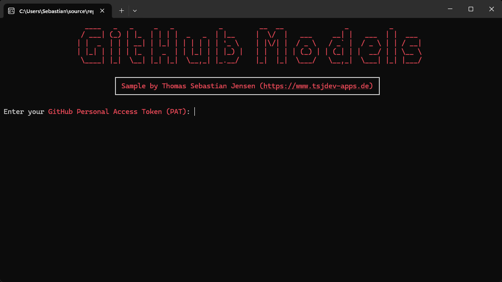
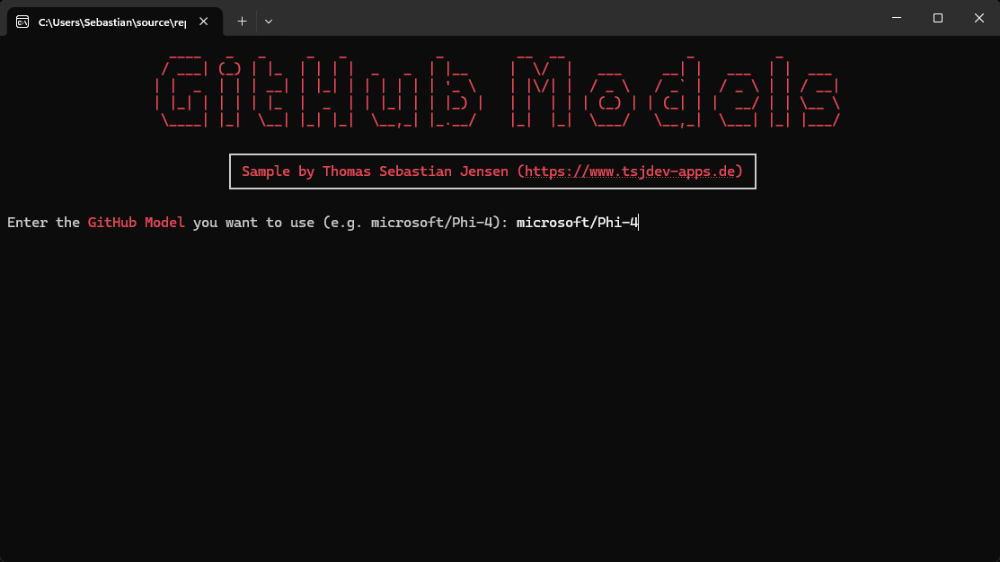
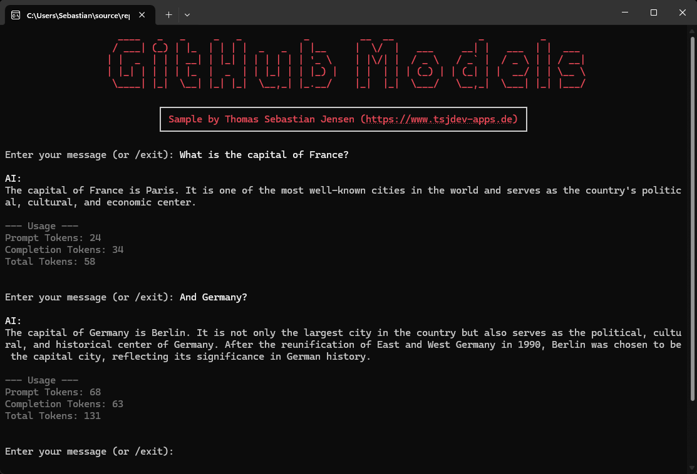

# GitHub Models Chat (.NET)

A simple **.NET console chat application** that connects to [GitHub Models](https://github.com/marketplace/models) for experimenting with different AI models — **completely free**, all you need is a GitHub account and a Personal Access Token (PAT).

## ✨ Features

- 🔑 Secure **GitHub PAT input** (masked)  
- 🤖 **Choose any model** at runtime (e.g., `microsoft/Phi-4`, `mistral-7b-instruct`)  
- ⚡ **Streaming responses** with live token output  
- 🧹 Smart **conversation history trimming**  
- 📊 **Usage statistics** (input, output, total tokens)  
- 🎨 Beautiful console output with [Spectre.Console](https://spectreconsole.net/)  

---

## 🚀 Getting Started

### 1. Clone the repository

```bash
git clone https://github.com/tsjdev-apps/github-models-chat-dotnet.git
cd github-models-chat-dotnet
```

### 2. Install dependencies

```bash
dotnet restore
```

### 3. Run the app

```bash
dotnet run --project GitHubModelsChat
```

## 🔑 GitHub Personal Access Token (PAT)

To use GitHub Models, you’ll need a GitHub account and a Personal Access Token:  

1. Go to [GitHub → Settings → Developer settings → Personal access tokens](https://github.com/settings/tokens)  
2. Create a **fine-grained token** with the required scope: *Models - read only*
3. Copy and store it securely — the app will prompt you for it at startup (masked input)  

## 🖼️ Screenshots

Here are some example screenshots of the application in action:  







## ⚠️ Usage Limits

This project is designed for **prototyping and testing** only.  
Each model has **usage limits**, so don’t expect to run production workloads.  

> ✅ For experimenting, comparing models, and learning — it’s a fantastic playground.  

## 📚 Resources

- [GitHub Models Documentation](https://docs.github.com/en/github-models)  
- [Azure.AI.Inference SDK](https://learn.microsoft.com/en-us/dotnet/api/azure.ai.inference)  
- [Spectre.Console](https://spectreconsole.net/)  

## 📌 License

This project is licensed under the MIT License — see the [LICENSE](LICENSE) file for details.
